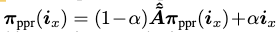
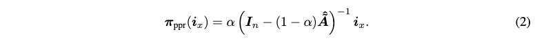
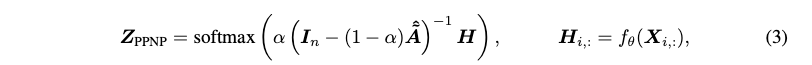
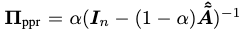
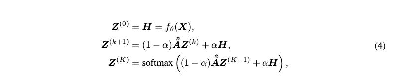

### APPNP

当GCN网络层数较高时，会出现过平滑问题，因为对于邻接矩阵（或者标准化后的邻接矩阵）进行多次乘方后，会收敛到类似于PageRank的图全局特征，而使得节点的特征不明显，从而导致过平滑。

所以GCN会限制层数，在一定程度上限制采样邻域的范围。

PPNP算法试图把矩阵从原始输入到特征的变换，以及邻居节点采样分离开来。

PPNP定义的PageRank可以用这种形式表示：

通过代数方法解的的结果如下：

PPNP的整体结构可以用下面的式子来表述：

其中personalized PageRank matrix为：

其中的yx表示节点x对于节点y的影响。

其中，求取矩阵的逆计算量过于庞大，所以选择一个近似的APPNP算法，其中的思想是，通过网络层后的H，通过引入$$\alpha $$来防止高层过平滑。

APPNP的迭代公式为：

